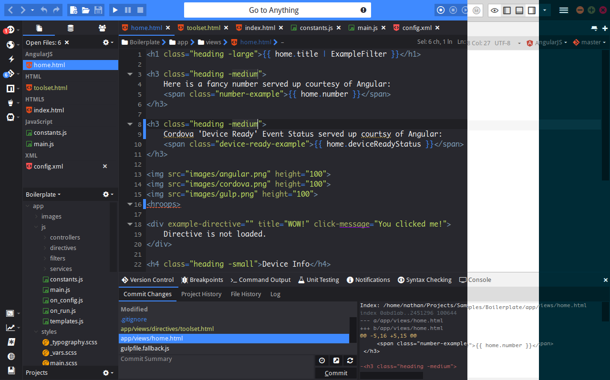

# Komodo Edit

This readme explains how to get started building, using and developing with
the Komodo Edit source base.

Whilst the main Komodo Edit source is hosted under this repository you may also
want to check out the individual component/addon repositories under
https://github.com/Komodo in case you only want to contribute to a specific
component. This'll save you some time and hassle as you would not have to build
the entire project.

Komodo Edit is the open-source version of Komodo IDE, any contributions made to
Komodo Edit will also be added to Komodo IDE. [You can check the differences between the two versions here](http://www.activestate.com/komodo-edit/compare-with-komodo-ide).

## Table of Contents

- [Screenshot](#screenshot)
- [Download](#download)
- [Feedback](#feedback)
- [Building Komodo](#building-komodo)
    - [Building on Windows](#building-on-windows)
    - [Building on Mac & Windows](#building-on-mac-&-windows)
    - [Building Complications](#building-complications)

## Screenshot



## Download

You can [download Komodo Edit here](http://www.activestate.com/komodo-edit), 
or if you wish to try the more powerful IDE  version you can [download Komodo 
IDE here](http://www.activestate.com/komodo-ide).

## Feedback

There are several ways to get in contact with the Komodo devs:

Github: <https://github.com/Komodo/KomodoEdit>

Forums: <http://community.activestate.com/forums/komodo>

Bug Tracker: <http://bugs.activestate.com/enter_bug.cgi?product=Komodo>

IRC: <irc://irc.mozilla.org/#komodo>

Mailing Lists: [komodo-discuss](http://code.activestate.com/lists/komodo-discuss/) & [komodo-beta](http://code.activestate.com/lists/komodo-beta/)

## Building Komodo

Note that these are simplified steps of the building process, for a more in-depth
guide check <BUILD.txt>.

### Building on Windows

- [Prerequisites](#prerequisites)
- [Building Steps](#building-steps)

#### Prerequisites

 * Python >=2.7 (but not Python 3.x yet). You can [install ActivePython from here](http://downloads.activestate.com/ActivePython/releases).

 * Visual C++ 11.0 (aka Visual Studio 2012) and all the Platform SDKs for
   building Mozilla with vc11 [as described here](http://developer.mozilla.org/en/docs/Windows_Build_Prerequisites).
   
 * Install [the latest "MozillaBuild-$ver.exe"](http://ftp.mozilla.org/pub/mozilla.org/mozilla/libraries/win32/) package into *the default dir*
   (i.e. "C:\mozilla-build").

 * Install the [latest ActivePerl](http://downloads.activestate.com/ActivePerl/releases/).

See <http://developer.mozilla.org/en/docs/Windows_Build_Prerequisites> for
more details on Windows build prerequisites. However, following the above
steps is *meant to be sufficient* to get Komodo building.

#### Building Steps

 * Checkout Komodo Edit: `git clone https://github.com/Komodo/KomodoEdit.git`

 * Using the command line, enter your checkout directory and run:

   ```
    cd mozilla
    setenv-moz-msvc11.bat
    python build.py configure -k 8.10
    python build.py distclean all
   ```

   This will configure and build mozilla and can take anywhere from 30 minutes
   to several hours to complete (depending on your specs). For most modern
   machines it should be about an hour.

 * After mozilla is built successfully go back to the main repo directory and
   build komodo:

   ```
    cd ..
    set PATH=util\black;%PATH%
    bk configure -V 8.10.0-devel
    bk build
   ```

   This should take significantly less time than building Mozilla.

 * Once the build has completed you can simply run Komodo by executing `bk run`
   
Upon making any modifications to the source you will again have to run `bk build`,
or simply `bk build && bk run` to quickly get back into Komodo. Subsequent builds
should be a lot faster as much of the compiled data is cached.

### Building on Mac & Linux

- [Mac Prerequisites](#mac-prerequisites)
- [Linux Prerequisites](#linux-prerequisites)
    - [Ubuntu](#ubuntu)
    - [Fedora](#fedora)
    - [Others](#others)
- [Building Steps](#building-steps-1)

#### Mac Prerequisites

 * Python >=2.7 (but not Python 3.x yet). You can
   [install ActivePython from here](http://downloads.activestate.com/ActivePython/releases).

   If you prefer the Python builds from python.org should be sufficient as well.

 * Xcode. [Install the latest one](http://developer.apple.com/tools/download/).

 * Xcode Command Line Tools.

   Open the Xcode preferences, then in the Downloads tab, select and install the
   Command Line Tools.

 * [MacPorts](http://www.macports.org/). (Note: Fink may work too but most of the
   build testing and instructions is done with MacPorts.)

 * autoconf v2.13. Once you have MacPorts installed you need just run
   `sudo port install autoconf213`

 * ensure you are using clang or gcc 4.2 (or higher)

See <http://developer.mozilla.org/en/docs/Mac_OS_X_Build_Prerequisites>
for more details on Mac OS X build prerequisites. However, following the
above steps is *meant to be sufficient* to get Komodo building.

#### Linux Prerequisites

##### Ubuntu

  `sudo apt-get build-dep firefox`

##### Fedora

  `sudo yum install gcc-c++ patch gtk2-devel libIDL-devel libcurl-devel`

##### Others

 * Python >=2.7 (but not Python 3.x yet). You can
   [install ActivePython from here](http://downloads.activestate.com/ActivePython/releases).

   If you prefer, your distro's Python 2.7 should be sufficient.

 * Everything mentioned in the
   [Mozilla Linux build prerequisites](http://developer.mozilla.org/en/docs/Linux_Build_Prerequisites):

#### Building Steps

 * Checkout Komodo Edit: `git clone https://github.com/Komodo/KomodoEdit.git`

 * Using the terminal, enter your checkout directory and run:

   ```
    cd komodo/mozilla
    python build.py configure -k 8.10
    python build.py distclean all
   ```

   This will configure and build mozilla and can take anywhere from 30 minutes
   to several hours to complete (depending on your specs). For most modern
   machines it should be about an hour.

 * After mozilla is built successfully go abck to the main repo directory and
   build komodo:

   ```
    cd ..
    export PATH=`pwd`/util/black:$PATH   # Komodo's "bk" build tool
    bk configure -V 8.10.0-devel
    bk build
   ```

   This should take significantly less time than building Mozilla.

 * Once the build has completed you can simply run Komodo by executing `bk run`

Upon making any modifications to the source you will again have to run `bk build`,
or simply `bk build && bk run` to quickly get back into Komodo. Subsequent builds
should be a lot faster as much of the compiled data is cached.

### Building Complications

If any errors occur during your first built-time and it is not obvious how to fix
the issue on your own please refer to the Feedback section on how to get in contact
with us.

Note that if building complications arise after you updated your repo with the latest
changes you might need to clear your local cache as it might be conflicting with the
new changes, to do this run `bk distclean` before running your build steps.
